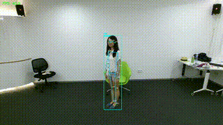

## 项目概述

`MoHAnoDetect` 为一套基于 **YOLO、ViTPose 与 STGCN** 的人体跌倒检测推理系统，支持视频流、摄像头与单帧图像输入。系统输出人体检测框、关键点骨架以及经时序建模与二次确认后的跌倒状态，适用于安防监控、养老场景等跌倒行为识别任务的工程化部署与验证。

核心入口脚本为 `infer_sim.py`，主要运行配置集中于 `config.yaml`。

---

## 运行环境与依赖

- **操作系统**：推荐 Windows 10 / 11（其他平台需根据实际环境调整）
- **Python 版本**：建议 Python 3.8–3.10
- **GPU 环境**：推荐使用带 CUDA 的 NVIDIA GPU；如仅在 CPU 上运行，需在安装 PyTorch 时选择对应的 CPU 版本
- **Conda 环境名称**：`my_env`

### 依赖说明

项目所需的第三方依赖已在 `requirements.txt` 中列出，并为主要组件给出了参考版本（默认假设使用 GPU 场景）：

- **深度学习与推理**  
  - `torch==2.1.0+cu121`  
  - `torchvision==0.16.0+cu121`  
  - `torch-tensorrt==2.1.0`（**必需，用于 TensorRT engine 推理，与 PyTorch 及 CUDA 版本需保持兼容**）  
  - `ultralytics==8.3.0`  
  - `onnxruntime==1.17.0`

- **计算机视觉与图像处理**  
  - `opencv-python==4.9.0.80`  
  - `numpy==1.26.4`  
  - `matplotlib==3.8.4`  
  - `scikit-image==0.22.0`  
  - `Pillow==10.3.0`

- **数据集与训练辅助**  
  - `pycocotools==2.0.7`  
  - `tqdm==4.66.4`  
  - `json_tricks==3.17.3`  
  - `filterpy==1.4.5`  
  - `munkres==1.1.4`

- **配置与工具组件**  
  - `PyYAML==6.0.1`  
  - `click==8.1.7`  
  - `ffmpeg-python==0.2.0`  
  - `Cython==3.0.10`  
  - `setuptools==69.5.1`

> **关于 CPU / GPU 版本选择**  
> - `torch`、`torchvision` 与 `torch-tensorrt` 的具体安装命令需根据实际 CUDA 版本与驱动情况确定。  
> - 建议优先参考 PyTorch 官方站点给出的安装命令（`https://pytorch.org`），选择“CUDA + Python + OS”组合后，使用推荐命令安装，再根据需要对 `requirements.txt` 中版本号进行微调。  
> - 如需在 **仅 CPU 环境** 下运行，请在安装 PyTorch 时选择 CPU 版本；此时 `torch-tensorrt` 功能将不可用，且基于 TensorRT 的 engine 文件无法在纯 CPU 环境中执行。

---

## 环境准备（基于 Conda）

1. **创建 Conda 环境（名称为 `my_env`）**

   ```bash
   conda create -n my_env python=3.10 -y
   ```

2. **激活环境**

   ```bash
   conda activate my_env
   ```

3. **安装 PyTorch / Torch-TensorRT（根据实际 CUDA 版本）**

   按照 PyTorch 官方网站给出的命令，在已激活的 `my_env` 环境中安装与本机 CUDA 版本兼容的：

   - `torch`
   - `torchvision`
   - （如需 GPU TensorRT 推理）`torch-tensorrt`

   示例（以 CUDA 12.1 对应的 wheel 为例，实际命令仍以官网为准）：

   ```bash
   # 请根据 https://pytorch.org 选择与本机 CUDA 对应的命令
   pip install torch==2.1.0+cu121 torchvision==0.16.0+cu121
   pip install torch-tensorrt==2.1.0
   ```

4. **安装其余项目依赖**

   在项目根目录（包含 `infer_sim.py` 和 `config.yaml` 的目录）执行：

   ```bash
   pip install -r requirements.txt
   ```

---

## 模型权重与目录结构

项目根目录主要文件与目录说明如下：

- `infer_sim.py`：跌倒检测推理主程序入口（支持视频、摄像头与图像模式）
- `config.yaml`：全局配置文件（模型路径、输入源、检测阈值、显示配置等）
- `checkpoints/`：模型权重目录
  - `vitpose-*.engine / .onnx / .pth`：ViTPose 人体姿态估计模型权重
  - `yolov8*.engine / .onnx / .pt`：YOLO 人体检测模型权重
  - `stgcn.onnx`：STGCN 跌倒行为分类模型权重
- `models/easy_ViTPose/`：ViTPose 及其工具代码
- `scripts/`：用于将 YOLO、ViTPose、STGCN 导出至 TensorRT 等格式的脚本

> **权重文件放置说明**  
> 使用方需根据自身路径规划准备好上述权重文件，并确保其路径与 `config.yaml` 中 `models` 小节保持一致。默认配置假定权重文件位于当前项目目录下的 `./checkpoints/` 目录中，也可根据需要调整为绝对路径。

---

## 配置文件说明（`config.yaml`）

`config.yaml` 为本项目的统一配置入口，主要配置项概览如下：

- **模型路径配置**
  - `models.vitpose`：ViTPose engine / ONNX / TorchScript 等模型文件路径（例如 `./checkpoints/vitpose-l-coco.engine`）
  - `models.yolo`：YOLOv8 模型文件路径（例如 `./checkpoints/yolov8s.engine` 或 `.pt` / `.onnx`）
  - `models.stgcn`：STGCN ONNX 模型文件路径（例如 `./checkpoints/stgcn.onnx`）

- **输入配置**
  - `input.source`：输入源
    - `"0"`, `"1"`：摄像头 ID
    - 本地视频文件路径（如 `"video.avi"`）
    - 单张图片路径（如 `F:/path/to/image.jpg`）
  - `input.mode`：运行模式
    - `"auto"`：自动识别输入源类型（摄像头 / 视频 / 图片）
    - `"video"`：强制视频/摄像头模式
    - `"image"`：强制单张图片模式
    - `"camera"`：摄像头模式
  - `input.rotate`：输入画面旋转角度，支持 `0` / `90` / `180` / `270`

- **检测与时序处理配置**
  - `detection.box_conf_threshold`：YOLO 检测置信度阈值
  - `detection.pose_conf_threshold`：关键点绘制与显示的置信度阈值
  - `detection.dataset`：关键点数据集类型（`coco` / `aic`）
  - `processing.window_size`：STGCN 时间窗口长度（帧数）
  - `processing.pose_interval`：每隔多少帧执行一次姿态估计
  - `processing.prediction_interval`：跌倒判定的帧间隔
  - `processing.fall_confirm_frames`：二次确认所需的连续跌倒帧数

- **设备与显示配置**
  - `device.use_cuda`：是否启用 CUDA（GPU 推理）
  - `device.stgcn_provider`：STGCN 推理后端（`CPUExecutionProvider` / `CUDAExecutionProvider`）
  - `drawing`：检测框、关键点与骨架绘制参数
  - `display`：结果展示文本、UI 信息（FPS、帧计数、缓冲区状态等）配置

在典型使用场景下，首次部署时建议至少核对或修改以下配置项：

- `models` 小节中的各模型文件路径；
- `input.source` 与 `input.mode`（摄像头 / 视频 / 图片）；
- `device.use_cuda` 与 `device.stgcn_provider`（根据是否具备 GPU 能力进行设置）。

---

## 使用说明

### 1. 视频 / 摄像头实时跌倒检测

1. 在 `config.yaml` 中确认或设置以下内容：
   - `models.vitpose`、`models.yolo`、`models.stgcn` 为实际存在的模型文件路径；
   - `input.source` 为摄像头 ID（如 `"0"`、`"1"`）或视频文件路径；
   - `input.mode` 设为 `"auto"` 或 `"video"`，其余检测与显示参数按需求调整。

2. 在 Conda 环境 `my_env` 中执行：

   ```bash
   conda activate my_env
   python infer_sim.py --config config.yaml
   ```

3. 程序启动后将打开可视化窗口，实时展示检测框、关键点骨架、跌倒判定结果以及 FPS 等信息。  
   按键行为：
   - `q`：终止推理并退出；
   - `p`：在终端打印当前帧的调试信息。

### 2. 单张图像跌倒检测

1. 在 `config.yaml` 中设置图像路径与模式：

   ```yaml
   input:
     source: "F:/data/test_image.jpg"
     mode: "image"
   ```

2. 在 Conda 环境 `my_env` 中执行：

   ```bash
   conda activate my_env
   python infer_sim.py --config config.yaml
   ```

3. 程序将对图像中的人体进行检测与姿态估计，构建 STGCN 所需的关键点序列并完成跌倒判定，随后根据 `output.image_path` 配置写出结果图像。如 `output.show_result` 为 `true` 时，将弹出窗口展示最终结果。

### 3. 命令行覆盖输入源（可选）

如需在不修改 `config.yaml` 的情况下临时调整输入源，可通过命令行参数覆盖配置文件中的 `input.source`：

```bash
python infer_sim.py --config config.yaml --input video.avi
```

摄像头示例：

```bash
python infer_sim.py --config config.yaml --input 0
```

---

## 外部系统集成（跌倒状态输出接口）

`infer_sim.py` 中的 `FallDetectionSystem` 对外提供跌倒状态查询与回调机制，可用于与上层业务系统对接。

- `system.get_fall_status()` 返回一个字典对象，包含：
  - `fall`：当前是否存在被二次确认的跌倒目标（布尔值）；
  - `fall_consecutive`：当前最大连续跌倒帧数（整型）；
  - `by_track`：按跟踪 ID 给出的跌倒状态明细。

在视频 / 摄像头模式下，可通过向 `run_main(config, fall_callback=...)` 传入回调函数，在每帧处理后获取跌倒状态，并执行告警、记录或联动逻辑，例如：

```python
def my_fall_callback(status):
    # 在此处实现告警、日志记录或与上层系统对接的逻辑
    print(status)

run_main(config, fall_callback=my_fall_callback)
```

## 效果演示
